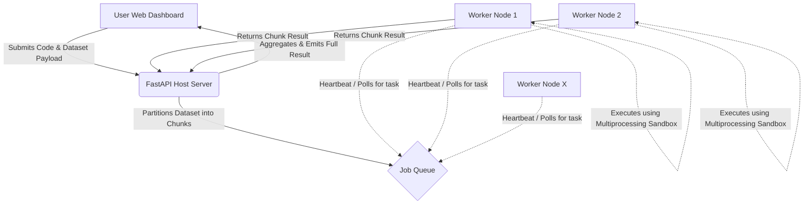

# Distributed Python Execution Host

A lightweight, turn-key distributed Python execution system built with FastAPI and Monaco Editor. This system allows a central Host PC to split heavy, chunkable Python workloads across multiple dynamically connected Worker nodes over a Local Area Network, all controllable from an aesthetic Web Dashboard.

## Features

- **Monaco Editor Integration**: Write the Python execution function natively in the browser with full syntax highlighting, bracket matching, and tab support using the exact engine that powers VS Code.
- **1-Click Scaling**: Any machine on the exact same Wi-Fi network can visit the host's LAN URL, click `Download Worker Node`, and automatically jump in as an active computing thread—zero manual IP configuration required.
- **Drag & Drop Datasets**: Don't waste time formatting inputs. Just drop massive `.json` Array datasets into the Web UI dropzone and the backend scales the partitioning dynamically.
- **Heartbeat Status Engine**: View the IPs of your active compute pool and track task completion chunks visually in real-time.

## Architecture



## Quick Start

### 1. Start the Host
On your primary machine, start the controller:
```bash
pip install -r requirements.txt
python host.py
```
Open your browser to `http://localhost:8000`. 
*(Note: To allow other network machines to access it, they will go to your LAN IP, e.g., `http://192.168.1.x:8000`)*

### 2. Connect Workers
Any machine serving as a worker (including the host itself) can either:
1. Navigate to the Web UI and hit **"⬇ 1-Click Worker Node"** and run the downloaded Python file.
2. Or strictly from the terminal:
```bash
python worker.py http://<YOUR_HOST_IP>:8000
```

### 3. Dispatch & Compute
Provide a dataset array, write the function in the Monaco IDE, and click **Distribute & Execute**.

---

## 🚀 Future Roadmap: The Shared IDE

The next phase of development for this prototype is transforming it into a **Live Shared IDE Environment**.
The goal is to allow multi-player concurrent code editing natively in the browser via WebSockets (similar to Google Docs or VS Code Live Share) hosted entirely on the central machine.
 
**Vision:**
- Multiple engineers can edit the core logic simultaneously in the browser.
- Run tests and deploy applications instantaneously.
- The heavy lifting (model training, chunk evaluations, large data rendering) is still seamlessly pipelined to the **Worker Nodes** pooling resources in the background.
