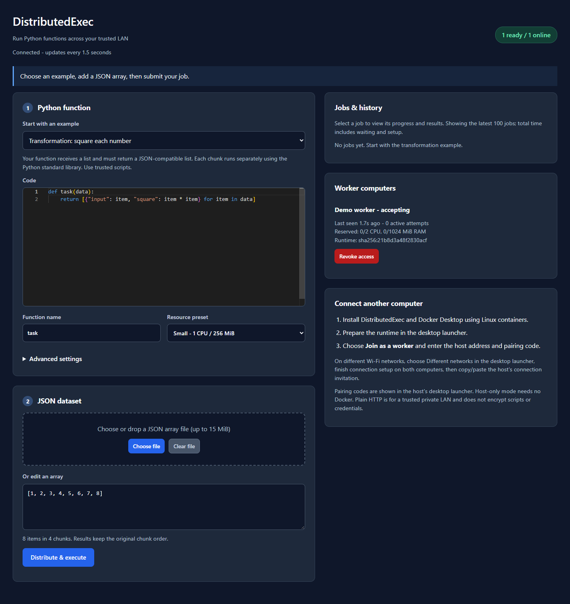
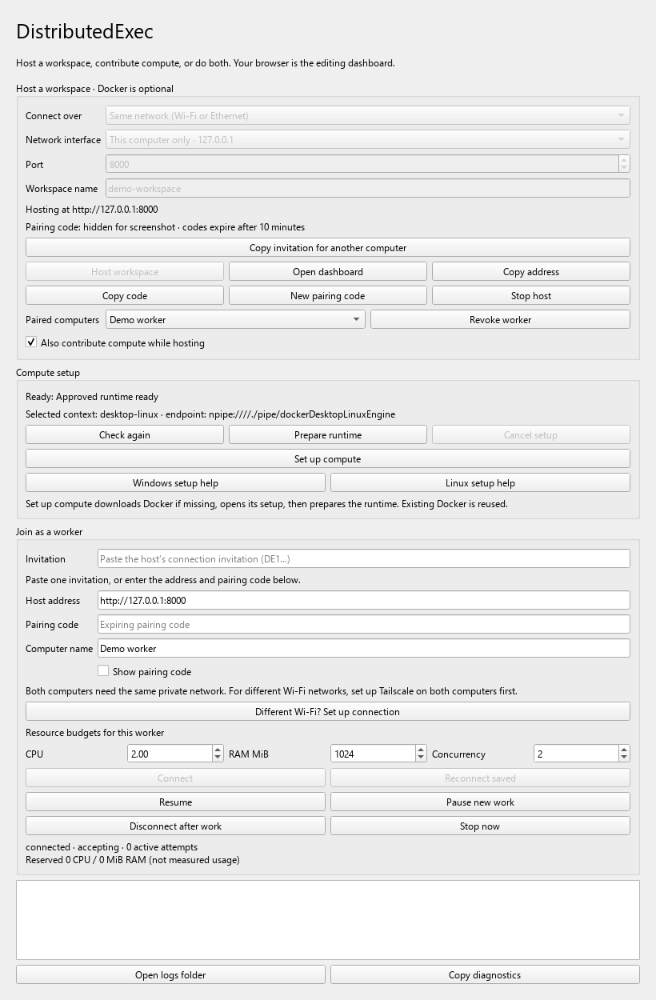
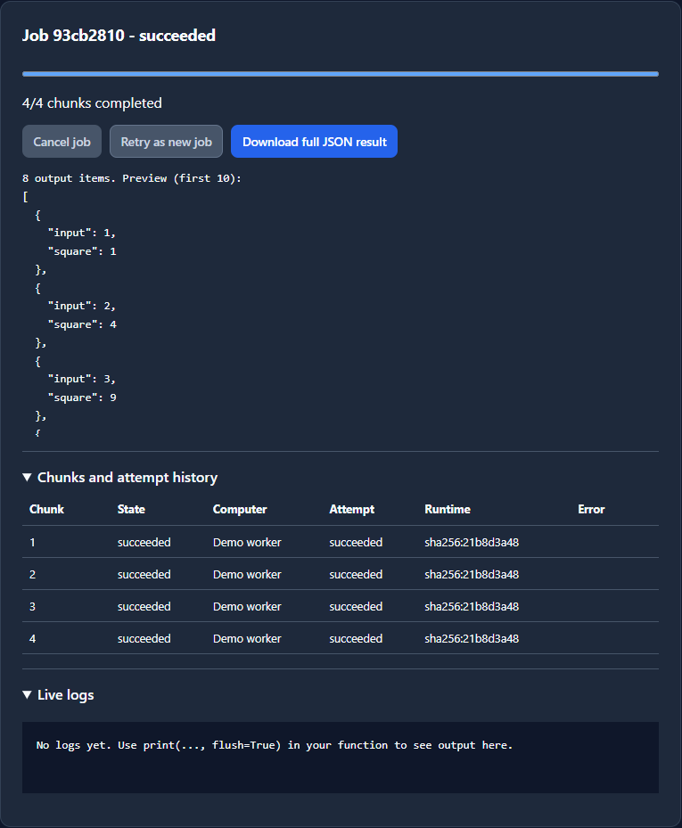

# DistributedExec

Run one Python job across several trusted computers. Give DistributedExec a function and a JSON list; it splits the list into smaller pieces, sends them to connected computers, and combines the results in the original order.

**[Download the Windows installer](https://github.com/jarvis0626/DistributedExec/releases/download/v1.2.0/DistributedExec-1.2.0-windows-x64-setup.exe)** ? [All releases](https://github.com/jarvis0626/DistributedExec/releases) ? [Connection help](docs/REMOTE_CONNECTIVITY.md)

The installer includes Python and the app's libraries. Install it, open the desktop launcher, and use the browser dashboard to write code, run jobs and download results.



*The browser dashboard: write your function on the left and see connected computers and job history on the right.*

## What are a host and a worker?

| Role | What it does | Needs Docker? |
| --- | --- | --- |
| **Host** | Starts the workspace, splits jobs, keeps history and collects results. | No |
| **Worker** | Contributes CPU and memory to run pieces of a job. | Yes ? use **Set up compute** |
| **Both** | Hosts the workspace and contributes compute on the same computer. | Yes |

One host can use several workers. You can also try everything on one computer by enabling **Also contribute compute while hosting**.

## Run your first job

1. **Install and open the app.** Run the Windows installer above. It creates a Start menu shortcut; there is no ZIP extraction or separate Python/pip setup.
2. **Start a host.** In the launcher, keep **Same network**, confirm the active network interface, and choose **Host workspace**. The browser dashboard opens automatically. Keep this launcher running.
3. **Add compute.** On a computer that will run jobs, choose **Set up compute**. The app reuses existing Docker or downloads its verified official installer, then prepares the runtime. Finish Docker's setup screens and any required Windows restart. For a one-computer trial, enable **Also contribute compute while hosting**. For a second computer, follow the connection steps below.
4. **Run the sample.** In the dashboard, keep **Transformation: square each number** and the sample dataset `[1, 2, 3, 4, 5, 6, 7, 8]`. Choose **Distribute & execute**.
5. **Check the result.** Select the job to see progress and attempts. Once it succeeds, choose **Download full JSON result**. Each input number is returned with its square.



*The desktop launcher handles hosting, compute setup, pairing and worker controls. This demo uses one computer; the pairing code is hidden in the screenshot.*

**Just checking the host?** Submit `[]`. It returns `[]` without a worker. A non-empty job waits until a ready worker connects.

## Connect another computer

Install DistributedExec on the worker computer and finish **Set up compute** there. Choose the connection method that matches your computers:

| Where are the computers? | What to do |
| --- | --- |
| **Same Wi-Fi or Ethernet network** | Keep **Same network** on the host and select its reachable LAN address. |
| **Different Wi-Fi networks or locations** | Choose **Different networks** on the host. Open **Different Wi-Fi? Set up connection** on the worker. Install/sign in to Tailscale on both computers, then choose **Check connection**. |

For Tailscale, use the same account on computers you own, or invite another person through Tailscale's private-network controls. Both computers need internet in this mode; no router port forwarding is required.

Once the host is running:

1. On the host, choose **Copy invitation for another computer** and share it privately.
2. On the worker, paste it into **Invitation** under **Join as a worker**. The host address and pairing code fill automatically.
3. Choose the worker's name and CPU/RAM/concurrency budgets, then select **Connect**. These budgets limit how much compute it contributes.

Invitations expire after at most ten minutes. Copy a fresh one if needed. A previously paired worker can use **Reconnect saved** with its original budgets. See [connection setup and troubleshooting](docs/REMOTE_CONNECTIVITY.md) for more detail.

## Write your own task

Your function receives a list and returns a JSON-compatible list. For example:

```python
def task(data):
    return [{"input": item, "square": item * item} for item in data]
```

For input `[2, 3, 4]`, the result is:

```json
[{"input": 2, "square": 4}, {"input": 3, "square": 9}, {"input": 4, "square": 16}]
```

Paste your dataset into the dashboard or choose/drop a JSON array file. **Clear file** returns to manual editing. The bundled compute runtime supports the Python standard library.

A **chunk** is one piece of the input list. With eight numbers and **Items per chunk = 2**, the app runs four chunks and joins their outputs in input order, even if they finish in a different order. Set chunk size and resource limits under **Advanced settings**. Each chunk runs separately, so it cannot share memory with another chunk.



*Real output from the eight-number example, run as four chunks on the demo worker. The download contains the full result; the dashboard shows a preview.*

## Everyday controls

- **Pause new work / Resume:** finish current work, then stop accepting new chunks until resumed.
- **Disconnect after work:** finish current chunks and disconnect the worker.
- **Stop now:** interrupt current work and disconnect immediately.
- **Cancel job:** stop that job. **Retry as new job** uses its original code, input and settings; submit a new job to use edits.
- **Open logs folder / Copy diagnostics:** get troubleshooting details from the launcher. Diagnostics exclude credentials and pairing codes.

Workspaces and job history survive app restarts. Uninstalling the app preserves your workspaces, settings, credentials and Docker. After initial compute setup, computers on the same LAN can run prepared jobs without internet.

## If something is stuck

| What you see | What to check |
| --- | --- |
| **Job waiting for a worker** | Connect a ready worker, resume it if paused, and make sure its available CPU/RAM can fit the job. |
| **Docker missing or stopped** | Choose **Set up compute**, finish Docker's setup, and retry after any required restart. Hosting still works without Docker. |
| **Wrong container mode** | Switch Docker Desktop to **Linux containers**. |
| **Pairing fails** | Copy a fresh invitation from the running host. After too many attempts, wait one minute before trying again. |
| **Another computer cannot connect** | Check the selected address, private-network connection and host firewall. The app does not change firewall rules. |
| **Dashboard asks you to sign in** | Choose **Open dashboard** in the host launcher to refresh the browser session. |
| **Host cannot start** | Choose a free port or a different workspace name. The app leaves existing services running. |

For setup failures, use **Open logs folder** and [connection help](docs/REMOTE_CONNECTIVITY.md). Do not share sensitive script output or datasets in support logs.

## Before you run important work

Use trusted computers and trusted scripts. Plain HTTP on a LAN does not encrypt data or credentials; cross-network mode carries traffic through Tailscale's encrypted private connection. Docker adds isolation but is not a complete boundary for hostile code. Do not expose the host to the public internet.

This app distributes independent chunks of a list; it does not automatically parallelize arbitrary Python programs. Startup and transfer overhead can make small jobs slower than running locally. Interrupted chunks may run again, so avoid tasks whose external side effects would be unsafe to repeat. Script errors, timeouts and invalid results fail clearly rather than retrying automatically.

More detail: [security limits](docs/SECURITY.md) ? [architecture](docs/ARCHITECTURE.md) ? [acceptance checklist](docs/ACCEPTANCE.md) ? [verification evidence](docs/VERIFICATION.md).

<details>
<summary><strong>For developers: run from source, build and verify</strong></summary>

### Run from source

Use Python 3.12 on Windows:

```powershell
py -3.12 -m venv .venv
.\.venv\Scripts\python.exe -m pip install -r requirements-lock.txt
.\.venv\Scripts\python.exe DistributedExec.py
```

Normal users need only the installer. For Linux workers, install [Docker Engine](https://docs.docker.com/engine/install/) and use **Prepare runtime**.

### Build the Windows installer

```powershell
powershell -ExecutionPolicy Bypass -File tools/build_windows.ps1
```

The script installs pinned build dependencies, collects license notices, runs host-only checks, builds/smoke-tests the bundled application, then compiles and checks the per-user installer. Output: `dist/DistributedExec-1.2.0-windows-x64-setup.exe` and its `.sha256` checksum. The intermediate application folder is at `dist/DistributedExec/`.

Installer smoke refuses to overwrite an existing registered installation; use a clean build account. The execution-policy override affects only this build process. The app installer is unsigned, so Windows may show a reputation prompt. See [installer design](docs/INSTALLER.md).

The [Windows build workflow](https://github.com/jarvis0626/DistributedExec/actions/workflows/windows-build.yml) uploads an installer artifact and checksum. It does not publish releases automatically. Attach the setup EXE itself to a GitHub release so users can download it directly.

### Checks and tools

```powershell
.\.venv\Scripts\python.exe -m pytest -q
.\.venv\Scripts\python.exe tools/failure_demo.py --output local-data/failure-demo
.\.venv\Scripts\python.exe example_benchmark.py --items 32 --chunk-size 16 --runs 2
.\.venv\Scripts\python.exe tools/capture_readme.py
```

The screenshot tool requires an already prepared Docker runtime and installed Edge (or `DISTRIBUTEDEXEC_BROWSER` pointing to Chromium). It starts an isolated loopback demo, captures the actual UI and a successful computation, hides the pairing code, and shuts down its demo services. It does not install dependencies or sign in to Tailscale.

CLI entry points are available through `host.py`, `worker.py` and `python -m distributedexec`. Hosts on all interfaces must approve advertised LAN addresses with `--address <IP>`. `--workspace` selects a coordinator workspace. Browser mutations require their session CSRF token and Origin; automation uses the owner's locally stored bearer secret.

The benchmark checks equivalent local/distributed result equality and includes queueing, startup, transfer, aggregation and download time. Two local workers demonstrate scheduling, not extra hardware capacity. See the [implementation checklist](IMPLEMENTATION.md) and [third-party notices](licenses/THIRD-PARTY.md).

</details>
