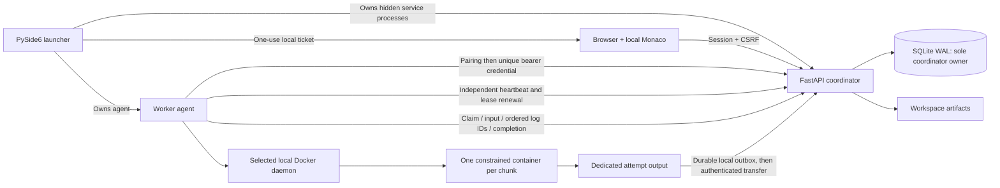

# Architecture and execution semantics

The original `task(data) -> list` model is retained. Inputs are ordered JSON arrays. Chunk size
defaults to 1,000 items and does not depend on worker count. New workers can join already queued jobs.
Each chunk gets a fresh container; imports are limited to the prepared standard-library image.
The host and worker agent never import submitted modules. They transfer and hash code/input; only
runtime/runner.py loads the Python module and calls the named function inside the container.
Container stdout/stderr are independent of result.json. A successful empty job returns `[]` without a container.

SQLite schema version 1 is created transactionally from migrations/001_initial.sql. Unsupported versions
fail clearly instead of assuming compatibility. Every write transaction starts `BEGIN IMMEDIATE`;
WAL, foreign keys and a five-second busy timeout are configured. Reads use a separate short snapshot.
Only one coordinator process owns a workspace, enforced by an OS-backed workspace lock. Agents use APIs,
never the SQLite file. A worker profile also has an OS-backed lock to prevent duplicate reconciliation.

Claims serialize through SQLite and filter available worker CPU, memory and concurrency reservations,
then priority descending, job submission time, chunk ordinal. Reservations are container limits, not
measured usage. Different workers can execute concurrently, and each agent has independent heartbeat,
reporting and local safety threads. No Redis, external database, shared LAN filesystem or Docker Compose.

## Transitions

| Entity | Transitions |
|---|---|
| Job | queued → running → succeeded; queued/running → failed or cancelled; empty → succeeded |
| Chunk | queued → running → succeeded; running → queued after retryable infrastructure loss; queued/running → cancelled on parent terminal intent; running → failed on deterministic failure/attempt limit |
| Attempt | running → succeeded, script_error, invalid_result, timeout, oom, infrastructure, interrupted, expired or cancelled; terminal history remains |
| Worker | accepting, paused, draining or stopped; online is computed from heartbeat age; credential expiry/revocation takes precedence |

Thirty-second leases use coordinator timestamps. Heartbeats renew every three seconds independently
of script execution. The local safety deadline uses monotonic time from request *send*, with a five-second
margin. Workers kill execution when a lease cannot renew before that deadline. Server-side acceptance
requires current attempt ownership, token, live lease, valid credential and active uncancelled parent.
An accepted completion is fingerprinted; unchanged retransmission cannot duplicate counters or results.
Changed retransmissions conflict. Accepted chunk state determines progress; no increment-on-every-request counter.

The two-second restart-safe reaper expires attempts and retries infrastructure loss/interruption only,
up to three attempts, with two- then four-second backoff. Script errors, invalid output, timeout and OOM
fail the parent without automatic retry. Other queued/running chunks are cancelled, pending attempt history
is retained and lease renewal stops. Cancellation is durable and cannot be reversed by reaping or late output.
Completion versus cancellation uses transaction order: a previously successful terminal job stays successful;
if cancellation commits first, the result is rejected. Manual retry creates a linked new job.

Execution is **at least once**. A chunk can execute again after a worker dies or loses its lease. External
side effects are not deduplicated. Only one current attempt's output contributes to aggregation.
Results are combined in original chunk order. Full-download artifacts are produced exclusively from
accepted durable chunk results, staged then atomically renamed; metadata includes size and SHA-256.
Workers persist completion and ordered log batches in restricted per-user outboxes before deleting
attempt directories. Reconnect replays unchanged sequence IDs and completions. Orphan reconciliation
uses application and worker labels, leaving unrelated containers intact. Killed agents' containers may
remain until that profile restarts or its owned cleanup runs; a timeout from the dead agent is unavailable.

## Limits

Defaults: upload 16 MiB, individual output 4 MiB, total job output 32 MiB, logs 256 KiB per attempt,
workspace content budget 512 MiB, 10,000 chunks per job. To reduce limits, put a `limits.json` in the
workspace before starting its host. Keys are `upload_bytes`, `chunk_output_bytes`, `job_output_bytes`,
`attempt_log_bytes`, `workspace_bytes`, `chunks_per_job`; validation rejects unknown/out-of-range values.
Maximum transfer/output caps remain the defaults in V1; the workspace content budget may be raised.

The workspace budget counts persisted payload/data/results/logs/events/artifacts. SQLite index/page/WAL
overhead and filesystem metadata can use extra disk space; this is an application content budget, not a
hard disk quota. Logs are bounded per attempt and process logs rotate. Archives are never purged automatically:
stop hosting, back up the workspace, then choose a new workspace when its budget is exhausted.

## Implementation references

- [SQLAlchemy SQLite transaction control](https://docs.sqlalchemy.org/en/20/dialects/sqlite.html)
- [Docker SDK container API](https://docker-py.readthedocs.io/en/stable/containers.html)
- [FastAPI security](https://fastapi.tiangolo.com/tutorial/security/)
- [PyInstaller runtime and frozen process behavior](https://pyinstaller.org/en/stable/runtime-information.html)
- [Qt for Python deployment](https://doc.qt.io/qtforpython-6/deployment/deployment-pyinstaller.html)
